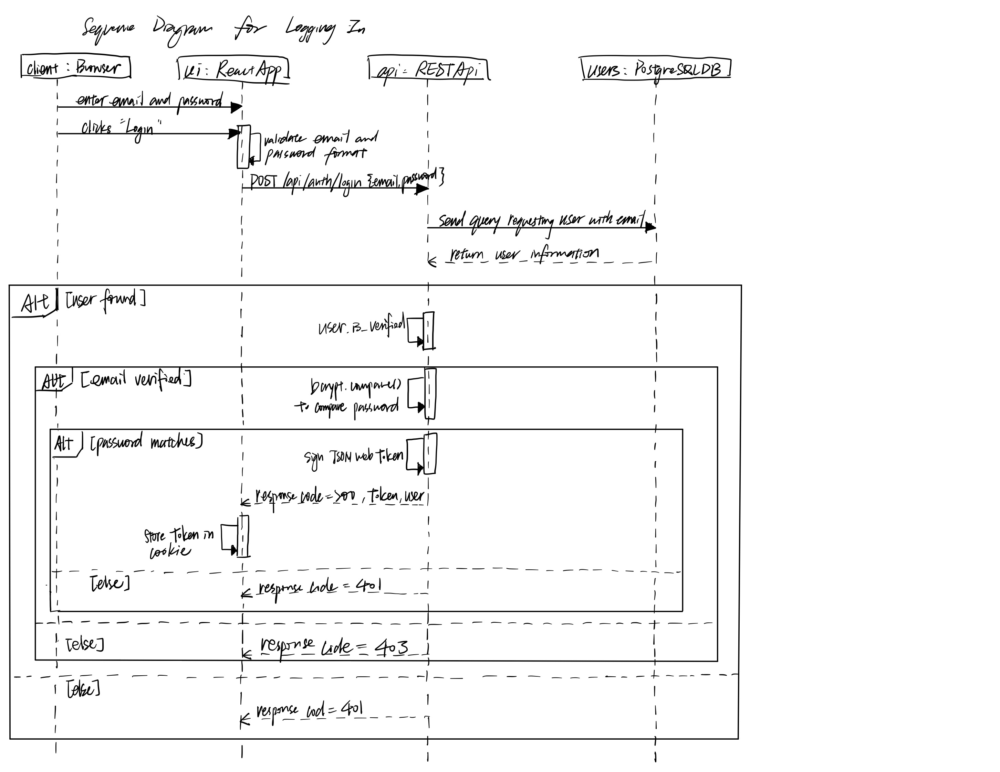

# 35L Project

## Build instructions
Perform the following actions on your terminal:

Clone the repository
`[git clone https://github.com/sweeprio/cs35l-project.git](https://github.com/ClaraY05/cs35l-project-minesweeper.git)`

Enter the directory `cd cs35l-project-minesweeper` to enter the root directory. 

`npm i` within root directory (`/`) to install all packages. The root folder is an npm project with 2 children npm workspaces.

`cd backend` and setup a Docker container for the postgres database. Similar instructions are described in "Setup Docker DB" below, but just to build the project:
1. Create .env files in root and backend with contents similar to .env.example in each directory. Copying the example contents verbatim will work for building the project.
2. Run `docker compose up -d`
3. While still in `/backend`, run `npm run migrate:up`. When you get a terminal message saying "Migrations complete!", your DB is setup and ready to go.

Afterward, while in root directory, run `npm run dev` (do not `npm run dev` within each subfolder, backend and frontend will be out of sync). You should be able to open the game at http://localhost:5173, unless that port is in use in which case vite will tell you which port the app is at in the console. Take note that backend only accepts connections from localhost:5173 so we suggest that you run this app when that port is not in use from something else.

When opening the game in the browser, use localhost, NOT ip address (127.0.0.1) as cors currently supports only localhost

## More about Docker

Install Docker Desktop for easier navigation.

Setup .env files similar to .env.example.

At the root of the directory all `docker compose up -d` to setup with yml. Check `docker ps` for "minesweeper-db" to see if this ran correctly. Should state the ports used. May give warning version is obsolete is docker version 3.9+.

Interact with db using `docker exec -it minesweeper-db psql -U minesweep_user -d minesweeper` aka info in environment, docker-compose. Now will display a screen showing `minesweeper=#` where you can input commands directly. To exit type `\q`

Enter the backend directory and run `npm run migrate:up`. This applies all the migration files in the /backend/migrations folder and sets up the required folders. You can also rollback to the most recent migration using `npm run migrate:down` if you need to undo a previous schema. 

If you need to add or modify the database schema, you need to create a new migration file instead of editing the current ones. You will run `npm run migrate create <name>` to create a new file, writing it to the new migration file and running `npm run migrate:up` again. Future migrations only need to report *what changed from the previous version*, so all migration history files (the unixtimestamp_filename.js files) need to persist for version control to work.

If when creating account you see the error code ECONNREFUSED, check that port matches. Once changes are made restart db with
`docker compose down`, then `docker compose up -d`.

## More about JWT
A JWT secret key is a confidential string used to sign and verify JSON Web Tokens (JWTs) in applications that use symmetric cryptography. It should be sufficiently long to resist brute-force attacks. You can generate a JWT secret key by visiting any JWT Secrety Key Generator. In this game, we have two separate JWT secret key for different purposes, one for authentication during login, the other for email verification during register. 

We provided two example keys in `.env.example` inside `/backend`. 

## More about Gmail SMTP setup
To create an app password, you need 2-Step Verification on your Google Account. Once done, visit https://myaccount.google.com/apppasswords. Follow the prompts to generate your app password. Save the 16-character password generated; this will be your SMTP password. 

Configure your SMTP setup in .env file in `/backend`

- SMTP_HOST: smtp.gmail.com
- SMTP_PORT: 587 for TLS
- SMTP_USER: Your complete Gmail address
- SMTP_PASS: Your newly generated app password
- APP_URL: Your base url for your app

## File structure

`/frontend` contains the React app and any user-facing components.
`/backend` contains the Node.js api used for game logic and board generation, and the db helper functions for communicating with postgres.
`/utils` contains anything that api and frontend need to share. `utils/types` contains the type contracts representing game state.

## Sequence Diagram Illustrating Login Endpoint

## Sequence Diagram Illustrating Reveal Cell Endpoint

## Music Credits
All audio / soundtracks made by [Braden Ou](https://www.linkedin.com/in/braden-ou-631b85223/).
Gameplay soundtrack features [Dr. Tobias Duerschmid](https://tobiasduerschmid.github.io/).
